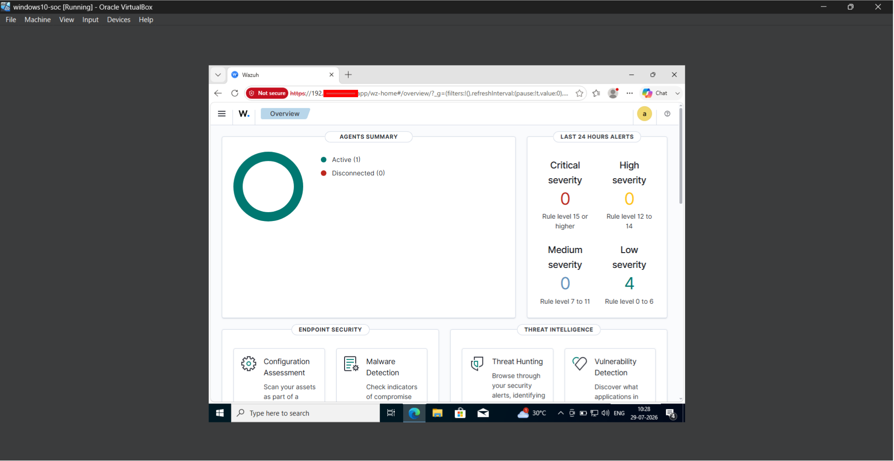
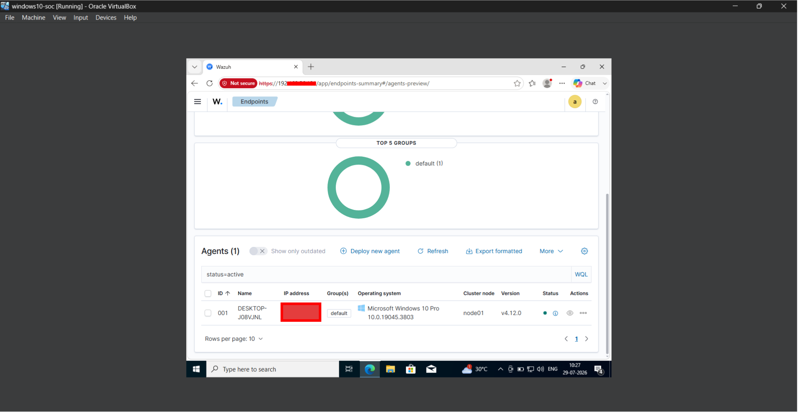
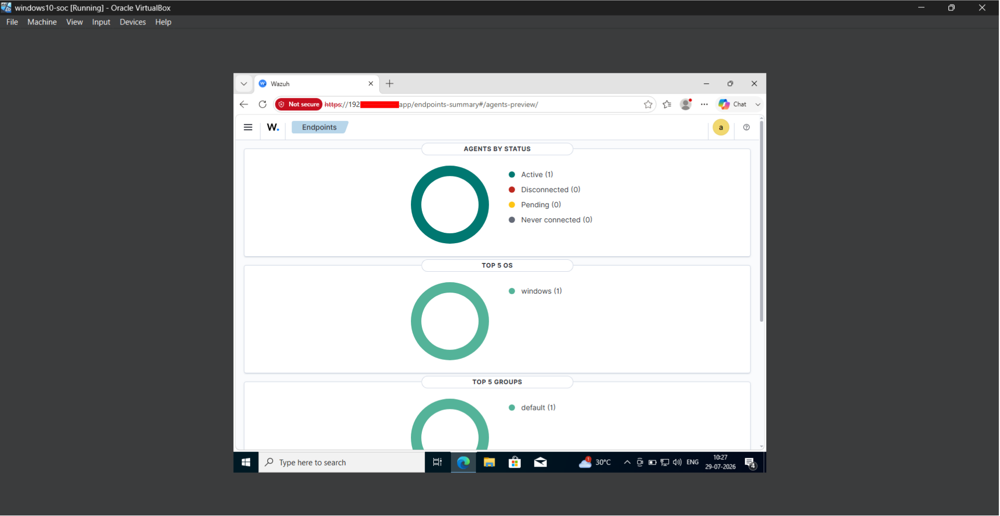
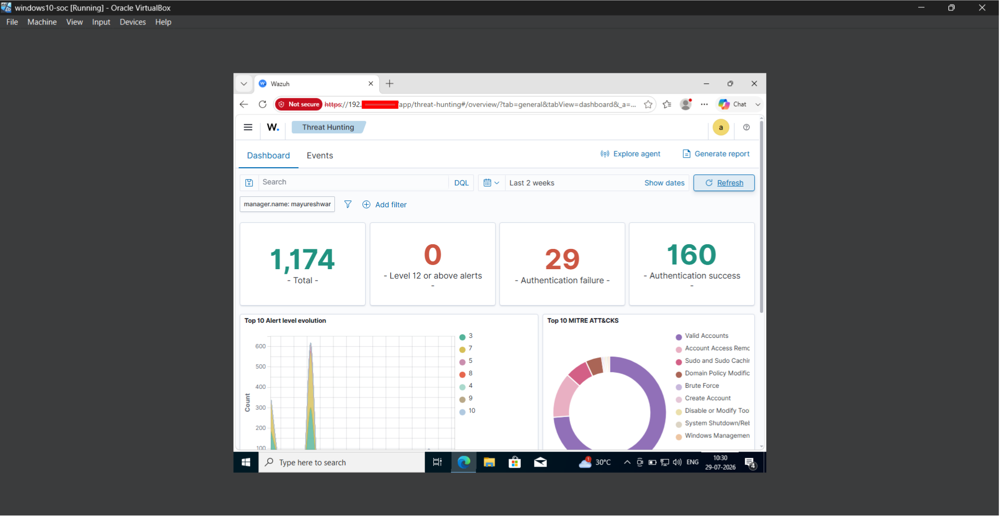
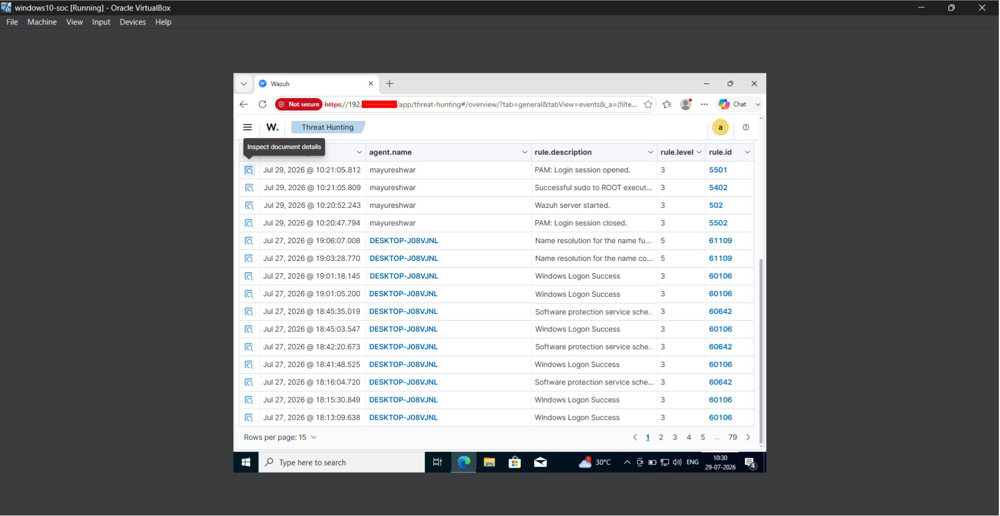
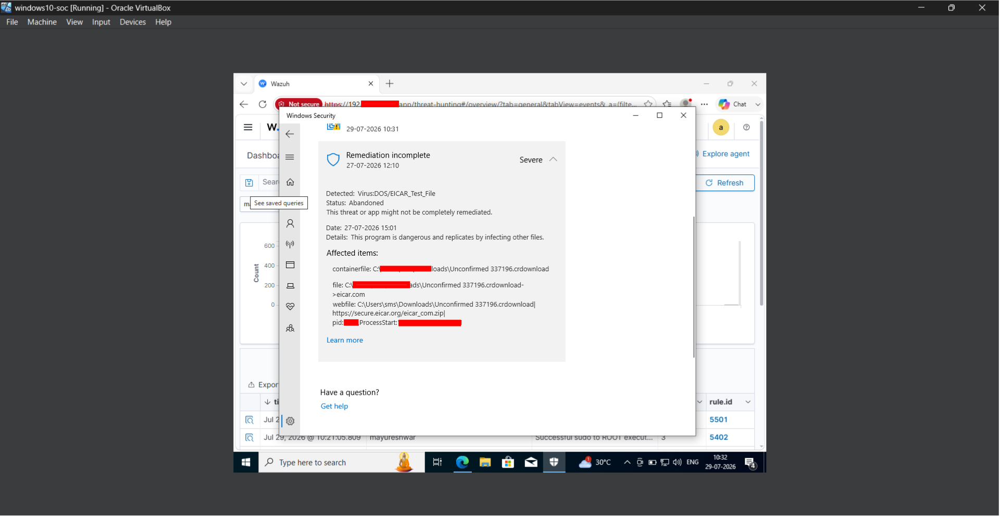

# 🛡️ Home SOC Lab using Wazuh SIEM

> A practical Home Security Operations Center (SOC) Lab built using **Wazuh SIEM**, **Ubuntu Server**, and **Windows 10** to monitor endpoints, collect security events, detect threats, and perform basic incident investigation in a virtual environment.

---

## 📌 Project Overview

This project demonstrates how to build a Home SOC (Security Operations Center) Lab using Wazuh SIEM. The lab monitors a Windows endpoint from an Ubuntu-based Wazuh server, allowing real-time log collection, threat detection, and threat hunting.

The environment was created for learning SOC operations, endpoint monitoring, and SIEM fundamentals through hands-on practice.

## ⭐ Project Highlights

- 🛡️ Built a functional home SOC environment using Wazuh SIEM
- 💻 Monitored a Windows 10 endpoint using the Wazuh Agent
- 🔍 Performed real-time threat hunting and security event analysis
- 🚨 Detected simulated failed login attempts
- 🦠 Tested malware detection using the EICAR test file
- 📊 Investigated security events through the Wazuh Dashboard
- 🏗️ Designed the lab using VirtualBox-based virtual machines

---

## 🎯 Objectives

- Build a virtual Home SOC Lab using Wazuh SIEM.
- Monitor a Windows 10 endpoint from an Ubuntu Server.
- Collect and analyze Windows security events.
- Detect failed login attempts.
- Simulate malware detection using the EICAR test file.
- Practice threat hunting and basic incident investigation.

- ---

## 🛠️ Technologies Used

| Technology | Purpose |
|------------|---------|
| Ubuntu Server | Hosted the Wazuh SIEM platform |
| Windows 10 | Endpoint monitored by Wazuh |
| Wazuh SIEM | Security monitoring and threat detection |
| Wazuh Agent | Collected logs from the Windows endpoint |
| VirtualBox | Virtualization platform for the lab |
| Windows Defender | Generated security events for malware testing |
| EICAR Test File | Simulated malware detection safely |

---

## 🖥️ Lab Environment

| Component | Configuration |
|-----------|---------------|
| Host Machine | Windows 11 |
| Virtualization | Oracle VirtualBox |
| SIEM Server | Ubuntu Server running Wazuh (Manager, Indexer, Dashboard) |
| Endpoint | Windows 10 Virtual Machine |
| Network | Host-Only Network for communication between the SIEM server and endpoint |

---

## 🏗️ Architecture

The Home SOC Lab consists of an Ubuntu Server running the Wazuh SIEM platform and a Windows 10 endpoint with the Wazuh Agent installed. Security events generated on the Windows endpoint are collected by the Wazuh Agent, forwarded to the Wazuh Manager, indexed, and visualized through the Wazuh Dashboard for threat hunting and analysis.

> ## 🏗️ Architecture diagram

The following architecture represents the complete Home SOC Lab environment, showing the Windows endpoint, Wazuh agent, Wazuh server, and dashboard along with the security-event detection flow.

> ---

## 🔍 Detection Scenarios

### 1️⃣ Failed Login Detection

**Objective:**  
Detect failed login attempts from the monitored Windows endpoint.

**Result:**  
Wazuh successfully collected Windows security logs and generated authentication-related events that could be investigated through the Threat Hunting dashboard.

---

### 2️⃣ Malware Simulation using EICAR

**Objective:**  
Simulate malware detection in a safe environment using the EICAR test file.

**Result:**  
Microsoft Defender detected the EICAR test file, allowing security events to be generated for monitoring and investigation within the SOC lab.

---

## 📚 What I Learned

Through this project, I gained practical experience in:

- Deploying a SIEM solution using Wazuh.
- Configuring a virtual cybersecurity lab with VirtualBox.
- Installing and managing the Wazuh Agent.
- Monitoring Windows security events.
- Performing basic threat hunting using the Wazuh Dashboard.
- Understanding the flow of security logs from endpoint to SIEM.
- Simulating security events for monitoring and validation.

- ---

## 🚀 Future Improvements

This project will continue to evolve with additional security capabilities, including:

- Sysmon integration for advanced Windows event logging.
- MITRE ATT&CK mapping for alert classification.
- Custom Wazuh detection rules.
- Active Response automation.
- File Integrity Monitoring (FIM).
- Email alerting for critical security events.
- Additional attack simulation scenarios.

## Screenshots
### Wazuh Overview Dashboard

### Wazuh Active Windows Agent

### Wazuh Endpoint Status Overview

### Wazuh Threat Hunting Dashboard

### Wazuh Threat Hunting Events

### EICAR Malware Detection

